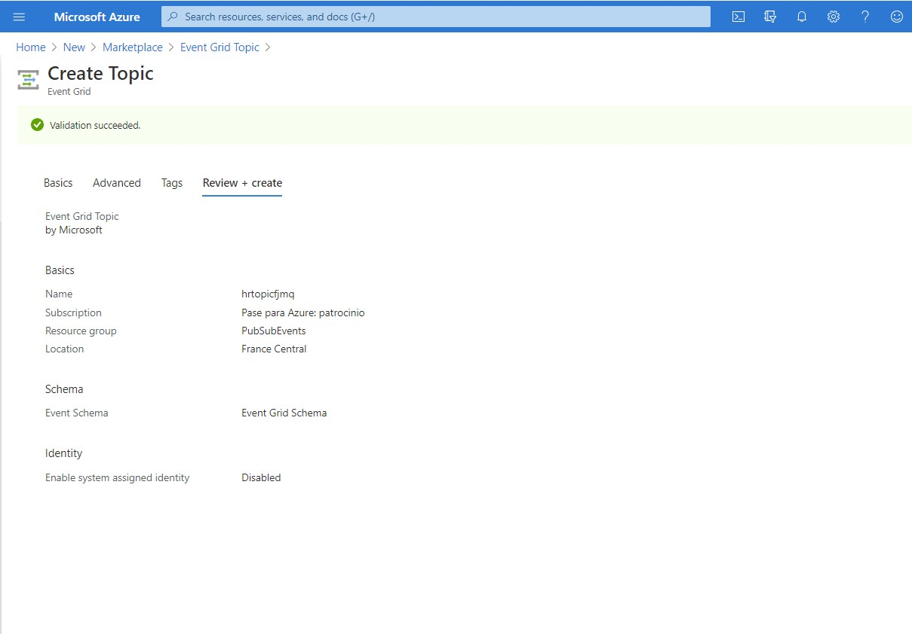
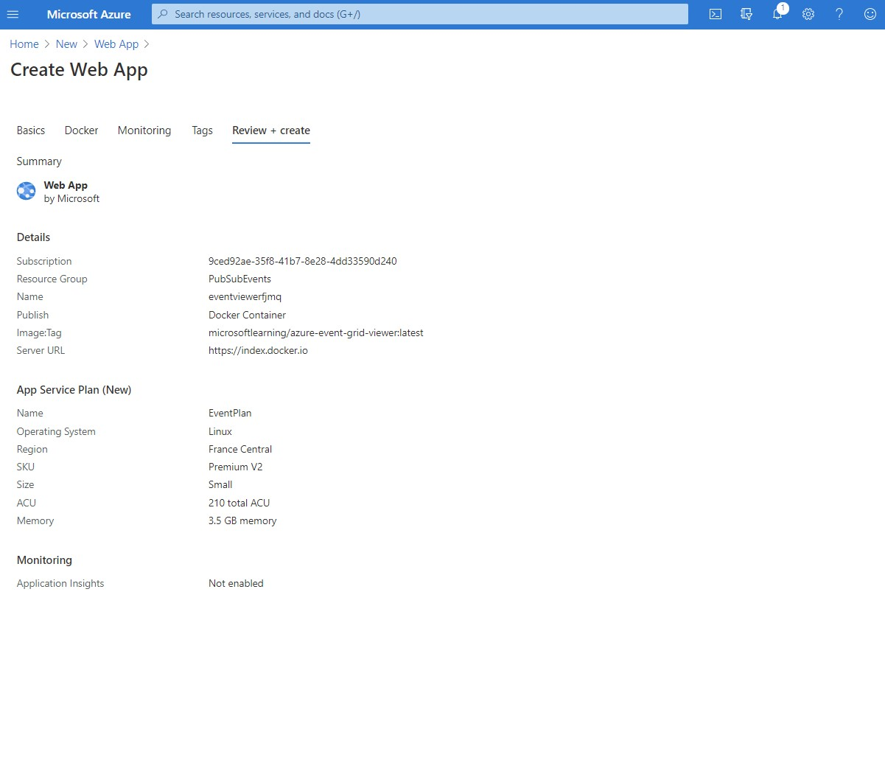
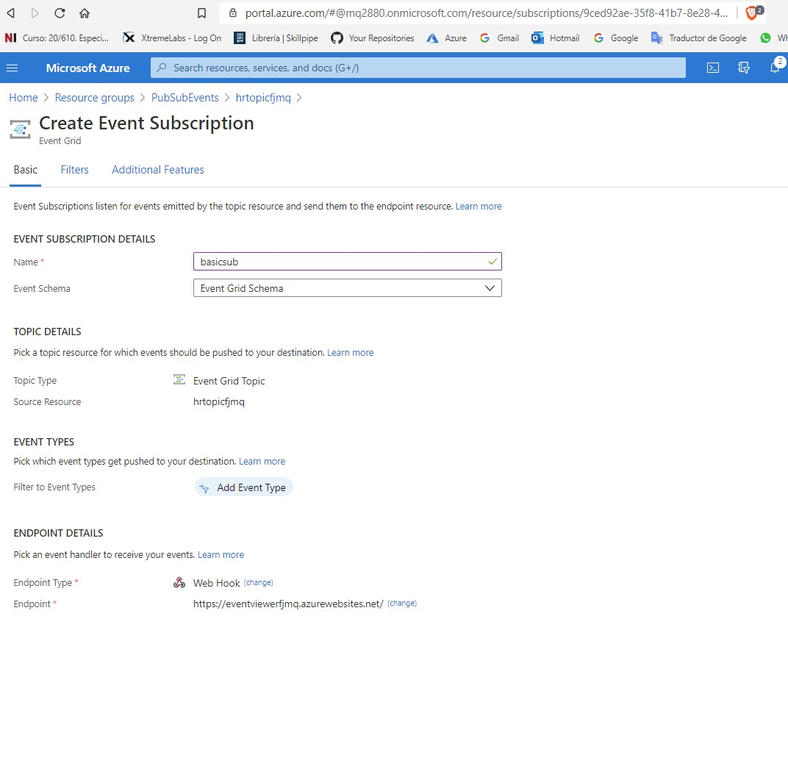
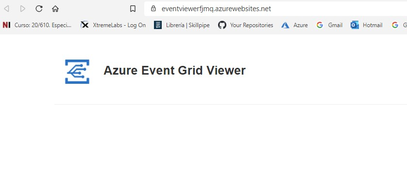
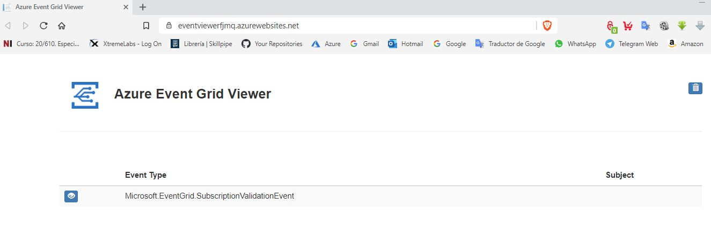
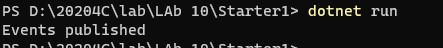
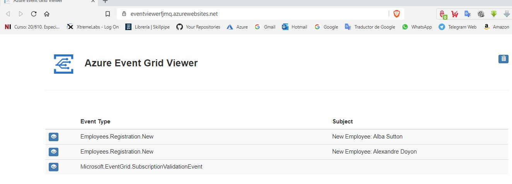

# Module 10 Develop event-based solutions

## Lab: Publishing and subscribing to Event Grid events

1. **Nombres y apellidos:** Francisco Javier Moreno Quevedo
2. **Fecha:** 17/01/2021
3. **Resumen del Ejercicio:** Crear un EVent Grid Topic para que recoja los eventos de una subscriipcion a una web
4. **Dificultad o problemas presentados y como se resolvieron:** Ninguna

### Exercise 1: Create Azure resources

Crear un **Event Grid Topic**




Crear una **Web App**



### Exercise 2: Create an Event Grid subscription

En el **Event Grid Topic **que hemos creado añadir una subscripcion asociar esa subscripcion a la **Web App** que hemos creado








### Exercise 3: Publish Event Grid events from .NET


Crear un nuevo proyecto   **EventPublisher**

```
dotnet new console --name EventPublisher --output .
```


Añadir el paquete **Microsoft.Azure.EventGrid** compilar

```
dotnet add package Microsoft.Azure.EventGrid --version 3.2.0
```

```
dotnet build
```

En el **Program.cs** borrar todo y añadir

```
using System;
using System.Collections.Generic;
using System.Threading.Tasks;
using Microsoft.Azure.EventGrid;
using Microsoft.Azure.EventGrid.Models;

namespace EventPublisher
{
    public class Program
    {
        private const string topicEndpoint = "https://hrtopicfjmq.francecentral-1.eventgrid.azure.net/api/events";
        private const string topicKey = "b1qEipaHQaO+LJPuJePXVz251Uww5HFJ3jOQSk8HhOo=";


        public static async Task Main(string[] args)
        {
            TopicCredentials credentials = new TopicCredentials(topicKey);
            EventGridClient client = new EventGridClient(credentials);

            List<EventGridEvent> events = new List<EventGridEvent>();

            var firstPerson = new
            {
                FullName = "Alba Sutton",
                Address = "4567 Pine Avenue, Edison, WA 97202"
            };

            EventGridEvent firstEvent = new EventGridEvent
            {
                Id = Guid.NewGuid().ToString(),
                EventType = "Employees.Registration.New",
                EventTime = DateTime.Now,
                Subject = $"New Employee: {firstPerson.FullName}",
                Data = firstPerson,
                DataVersion = "1.0.0"
            };
            events.Add(firstEvent);

            var secondPerson = new
            {
                FullName = "Alexandre Doyon",
                Address = "456 College Street, Bow, WA 98107"
            };

            EventGridEvent secondEvent = new EventGridEvent
            {
                Id = Guid.NewGuid().ToString(),
                EventType = "Employees.Registration.New",
                EventTime = DateTime.Now,
                Subject = $"New Employee: {secondPerson.FullName}",
                Data = secondPerson,
                DataVersion = "1.0.0"
            };
            events.Add(secondEvent);

            string topicHostname = new Uri(topicEndpoint).Host;
            await client.PublishEventsAsync(topicHostname, events);

            Console.WriteLine("Events published");
        }
    }
}

```

Ejecutar

```
dotnet run
```


Comprobar que se han publicado los nuevos eventos 








